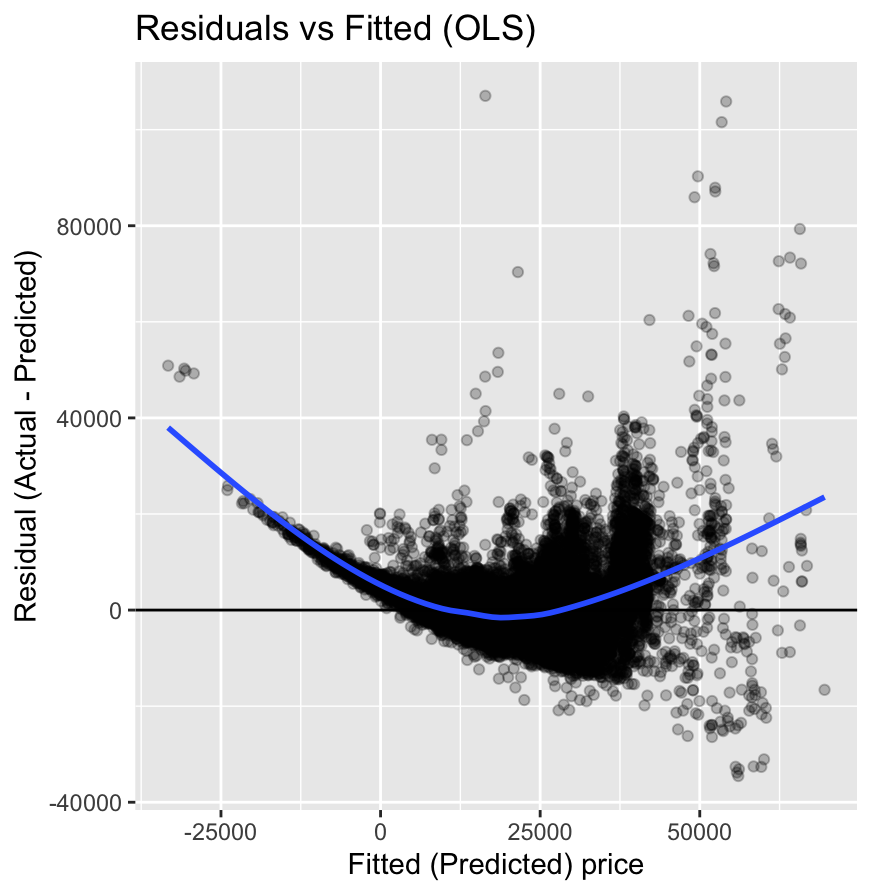
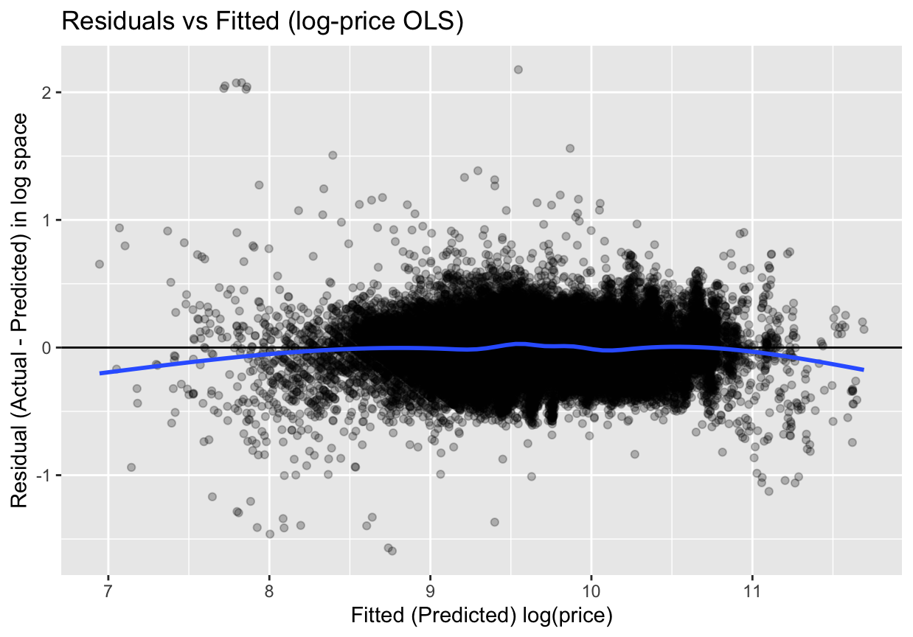

<p align="center">
  
</p>

# Used Car Price Modeling (OLS & Log-OLS in R)

## Project Overview

This project applies statistical modeling techniques in R to predict used car prices using real-world data from Kaggle.  
The objective is not only to build a predictive model, but to diagnose model assumptions, identify violations, and apply principled improvements.

The analysis follows a classical data science workflow:
1. Baseline modeling with Ordinary Least Squares (OLS)
2. Model diagnostics
3. Identification of heteroskedasticity and non-linearity
4. Log-transformation of the target variable
5. Model comparison and interpretation

---

## Dataset

**Source:** [Kaggle Used Car Dataset (Ford, Mercedes, BMW, Audi, etc.) ](https://www.kaggle.com/datasets/adityadesai13/used-car-dataset-ford-and-mercedes) 

The dataset contains used car listings from the UK market, split across multiple CSV files by brand.

### Key variables
- `price` (target)
- `year` → engineered into `age`
- `mileage`
- `engineSize`
- `mpg`
- `tax`
- `transmission`
- `fuelType`
- `brand`

Multiple brand-specific datasets were combined into a single analytical table.

---

## Data Preparation

Key preprocessing steps:
- Combined multiple brand CSVs into a unified dataset
- Engineered car age from model year
- Converted categorical variables to factors
- Removed invalid and extreme values (e.g., negative prices, unrealistic mileage)
- Split data into training (80%) and test (20%) sets

---

## Baseline Model: Ordinary Least Squares (OLS)

### Model specification
```r
price ~ age + mileage + mpg + engineSize + tax +
        transmission + fuelType + brand
```

### Key findings
- Strong, intuitive effects for age, mileage, engine size, and brand
- High explanatory power (R² ≈ 0.78)
- Diagnostic plots revealed:
  - **Heteroskedasticity** (error variance increases with price)
  - **Non-linearity** (systematic curvature in residuals)

---

## Model Diagnostics (OLS)

Residuals vs fitted values showed:
- Funnel-shaped variance pattern
- Underestimation of expensive cars and overestimation of mid-range cars

<p align="center"></p>

These issues motivated transforming the response variable.

---

## Improved Model: Log-Transformed OLS

To address heteroskedasticity and non-linearity, the response variable was log-transformed.

### Model specification
```r
log(price) ~ age + mileage + mpg + engineSize + tax +
             transmission + fuelType + brand
```

---

## Results After Log Transformation

### Diagnostic improvements
- Residuals are centered around zero
- Variance is more stable across fitted values
- Linearity assumption is substantially improved

### Model fit
- Adjusted R² ≈ **0.88**
- Residual standard error significantly reduced (in log space)

<p align="center"></p>

---

## Model Performance (Test Set)

Predictions from the log model were back-transformed to the original price scale.

| Metric | Original OLS | Log-OLS |
|------|--------------|--------|
| RMSE | ~£4,800 | **~£4,300** |
| MAE  | ~£2,700–3,000 | **~£2,500** |

The log-transformed model demonstrates better generalisation to unseen data.

---

## Interpretation of Log-Model Coefficients

In the log-price model, coefficients represent approximate percentage effects:

- Each additional year of age → ~11% decrease in price
- 10,000 additional miles → ~5% decrease in price
- 1L increase in engine size → ~36% increase in price
- Brand coefficients reflect market positioning rather than absolute price differences

---

## Key Takeaways

- OLS provides a strong and interpretable baseline
- Diagnostic plots are essential and high R² alone is insufficient
- Log-transforming price is a principled response to heteroskedasticity
- Model improvements should be justified by evidence, not added complexity

---

## Tools & Libraries

- R
- `tidyverse`
- `caret`
- `ggplot2`

---

## Possible Extensions

- Add model-level predictors (trim, specification)
- Apply ridge / lasso regression
- Compare against regression trees
- Reframe as a classification task (e.g., high-price vs low-price cars)


<p align="center"><sub>Authored by <b>Sevban Ekşi (st3kin)</b> 2025</sub></p>
